<p align="center">
  <h1 align="center">无人机管理平台</h1>
</p>

<p align="center">面向无人机仓储、借还、监控与运维的一体化管理平台 · 支持客户深度定制</p>

<p align="center">
  
  
  
  
</p>

---

## 一、项目简介

**无人机管理平台** 是一套用于无人机集中管理的信息化系统，覆盖无人机台账、RFID 借还、储存室 3D 导航、实时环境监控、视频巡查、告警处置、人员进出统计、报表与日志、角色权限等核心场景。系统采用前后端分离架构，前端基于 Vue 3 + TypeScript + Element Plus（art-design-pro 模板框架），后端基于 Go + Gin + GORM，默认使用本地 SQLite 数据库，可一键切换为 MySQL，开箱即用、零外部依赖。

本平台面向行业客户交付，支持从名称、Logo、主题到数据库、权限、演示数据等多维度的**个性化定制**（详见下文「客户定制指南」）。

## 二、功能特性

| 模块 | 说明 |
| --- | --- |
| 数据展示大屏 | 实时数据总览、储存分析、告警与环境设备状态看板 |
| 无人机管理 | RFID 电子标签台账、在库/借出/设备状态（完好/损坏/报废）实时统计、自动盘点 |
| 储存管理 | 储存室 3D 导航地图、密集架/库位可视化、分散控制 + 集中管理 |
| RFID 借还 | 扫码借出/归还，自动记录借用人、时间、预计归还、实时时长，归还时自动开区并更新库存 |
| 运行环境 | 支持国产化软硬件环境，展示储存数据、告警、设备自检状态 |
| 视频监控 | 实时预览、摄像头集中管理、密集架录像与开架记录回放（RTSP） |
| 告警管理 | 断网告警、水浸告警、设备异常等实时告警与处置 |
| 人员进出 | 刷卡失败超限、开门、关门、人脸通行等进出统计 |
| 报表管理 | 日/周/月/年报表，图形化展示，支持导出/打印为 Excel |
| 系统管理 | 角色与权限管理、系统日志、数据查询（设备历史/告警事件/操作/进出记录） |
| 第三方接口 | 预留第三方对接接口，便于二次开发与系统集成 |

## 三、技术栈

- **前端**：Vue 3、TypeScript、Vite、Element Plus、Pinia、Tailwind CSS、art-design-pro 模板框架
- **后端**：Go、Gin、GORM、golang-jwt、excelize（Excel 导出）
- **数据库**：SQLite（默认，纯 Go 实现，零依赖）/ MySQL（可切换）
- **接口规范**：统一响应体 `{ code, msg, data }`，JWT 鉴权，支持分页

## 四、快速开始

### 4.1 后端

```bash
cd server

# 构建（Windows 示例，其他平台同理）
go build -o drone-server.exe .

# 运行（默认监听 :8080，首次启动自动建表并写入数据）
./drone-server.exe
```

> 后端首次启动会自动创建数据库表，并根据配置写入角色、管理员账号与（可选的）演示数据。
> 若需切换为 MySQL，修改 `server/config/config.yaml` 中 `database.driver` 为 `mysql` 并填写连接信息即可，业务代码无需改动。

### 4.2 前端

```bash
# 安装依赖
pnpm install

# 本地开发（通过 Vite 代理将 /api 转发到后端 :8080）
pnpm dev

# 生产构建
pnpm build
```

### 4.3 默认账号

| 账号 | 密码 | 角色 | 说明 |
| --- | --- | --- | --- |
| `admin` | `admin123` | 超级管理员 | 始终初始化，拥有全部权限 |
| `operator` | `operator123` | 操作员 | 演示数据开启时写入，用于日常借还与监控 |

## 五、客户定制指南

本平台交付时即考虑二次定制需求，常见定制点如下：

| 定制项 | 修改位置 | 说明 |
| --- | --- | --- |
| **系统名称 / 标题** | `src/config/index.ts` 中 `systemInfo.name`；`index.html` 的 `<title>` | 改为客户单位名称 |
| **Logo / 品牌图标** | `public/` 下图标与 `src/assets/` 内图片 | 替换为客户 LOGO |
| **主题色 / 样式** | `src/styles/` 与 Tailwind/SCSS 变量、框架主题配置 | 适配客户 VI 视觉规范（支持明/暗主题） |
| **数据库切换** | `server/config/config.yaml` 中 `database.driver`（`sqlite` / `mysql`） | 本地演示用 SQLite，正式部署可切 MySQL |
| **演示数据** | `server/config/config.yaml` 中 `app.seedDemoData`（`true` / `false`） | `true` 写入演示数据便于演示；`false` 为干净空系统（仍含角色与管理员） |
| **接口地址** | 前端 `.env.development`（`VITE_API_PROXY_URL`）、`.env.production`（`VITE_API_URL`） | 指向实际后端地址 |
| **鉴权密钥 / 跨域** | `server/config/config.yaml` 中 `jwt.secret`、`cors.allowOrigins` | 生产环境请改为随机强密钥 |
| **角色与权限** | `server/internal/db/seed.go` 中 `seedRoles()` | 按需增减角色与权限点 |
| **储存室 / 密集架 / 库位** | `server/internal/db/seed.go` 中 `seedRoomsAndRacks()` | 按客户实际仓储结构初始化 |
| **视频通道** | `server/internal/db/seed.go` 中 `seedVideos()`（RTSP 地址） | 接入客户真实摄像头 |
| **第三方对接** | `server/internal/router/router.go` 中 `/integration/*` 预留接口 | 用于系统集成与数据推送 |

> 详细的接口定义、请求/响应字段、错误码、数据库切换与部署说明，见 `server/API接口文档.md`。

## 六、界面预览

> 以下为系统启动后的真实运行截图（演示数据已开启），默认账号 `admin` / `admin123` 登录后即可查看。

### 登录页

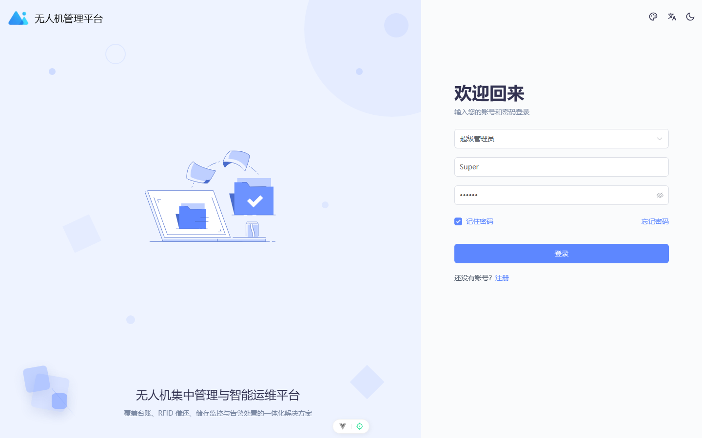

### 数据大屏

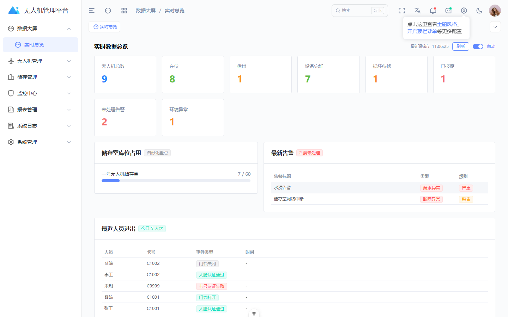

### 无人机台账

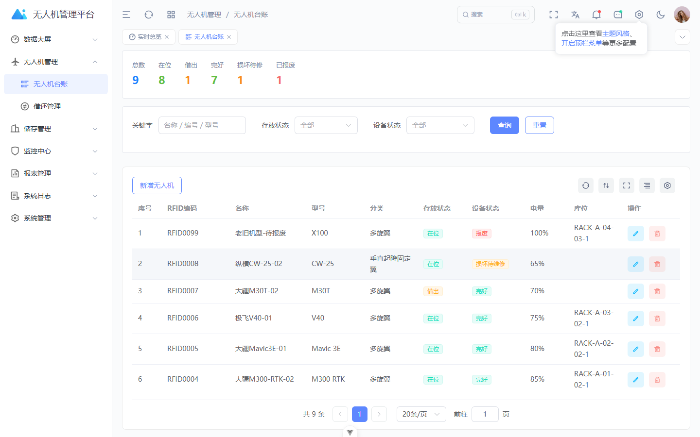

### RFID 借还管理

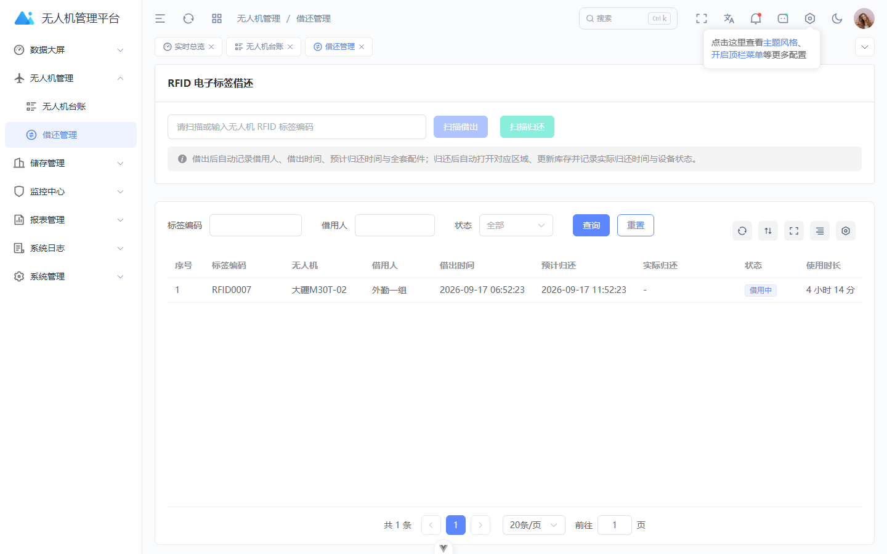

### 储存室 3D 导航图

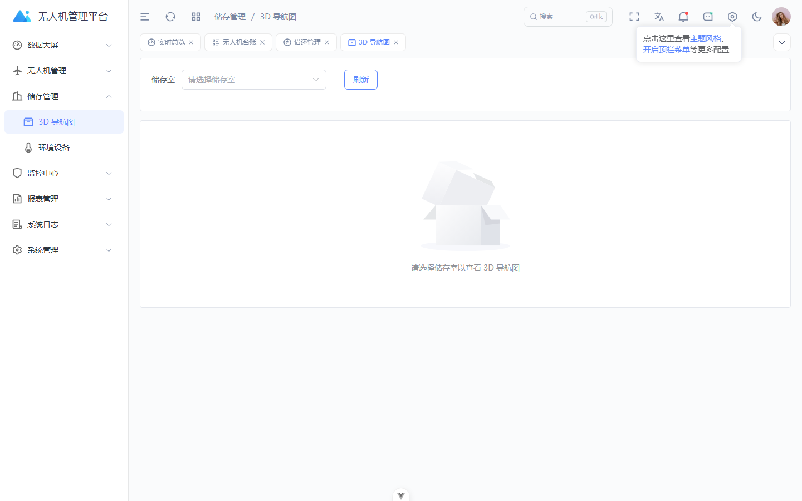

### 环境设备监控

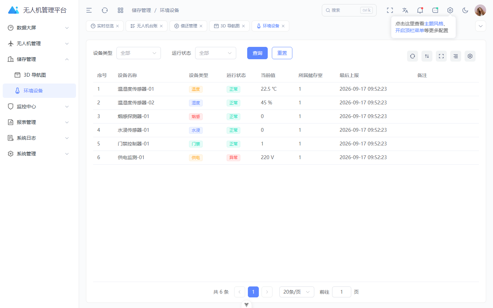

### 告警管理

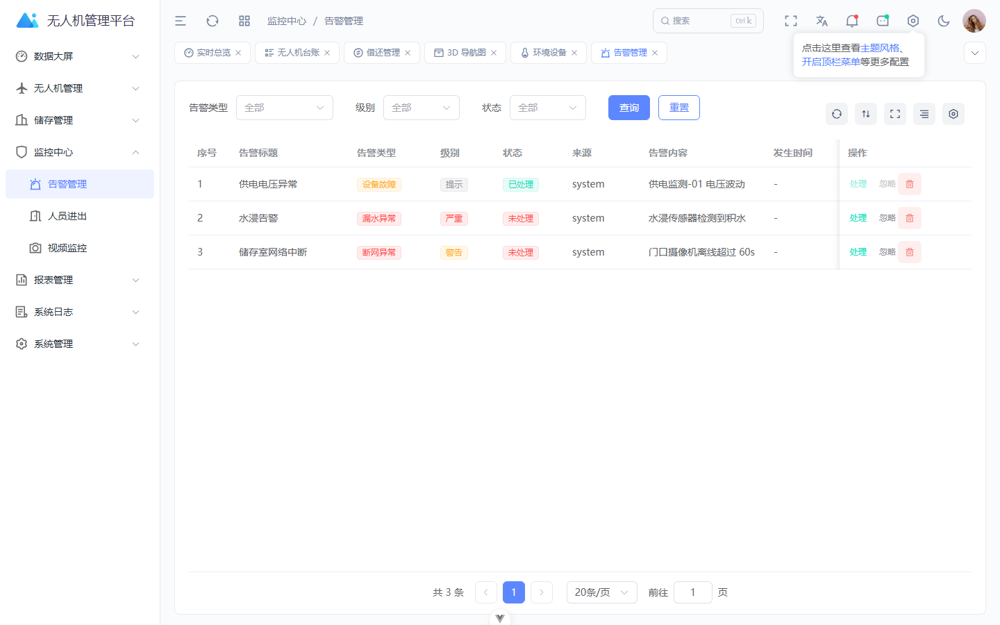

### 人员进出统计

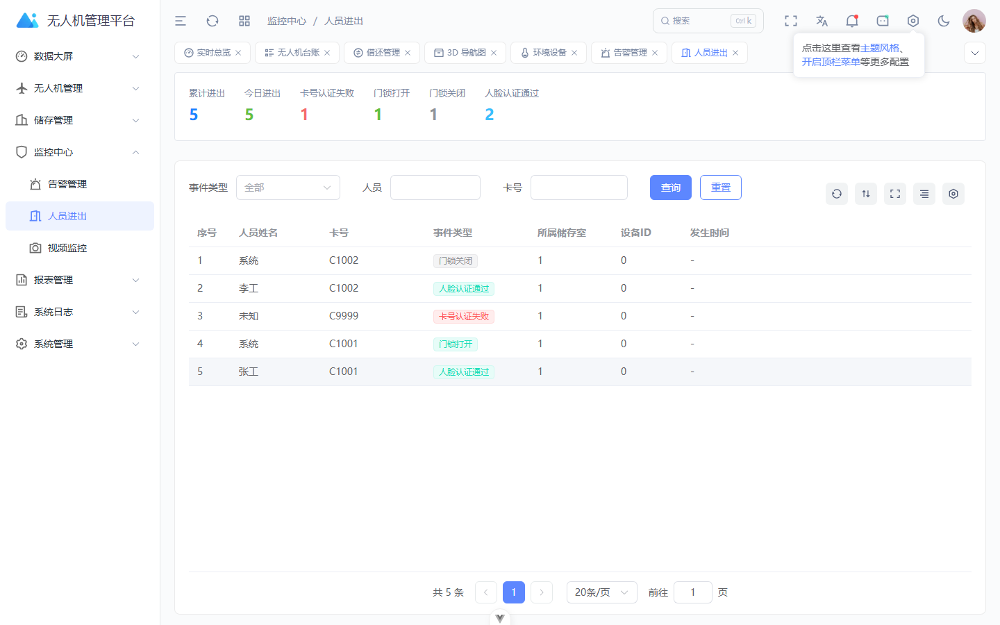

### 视频监控

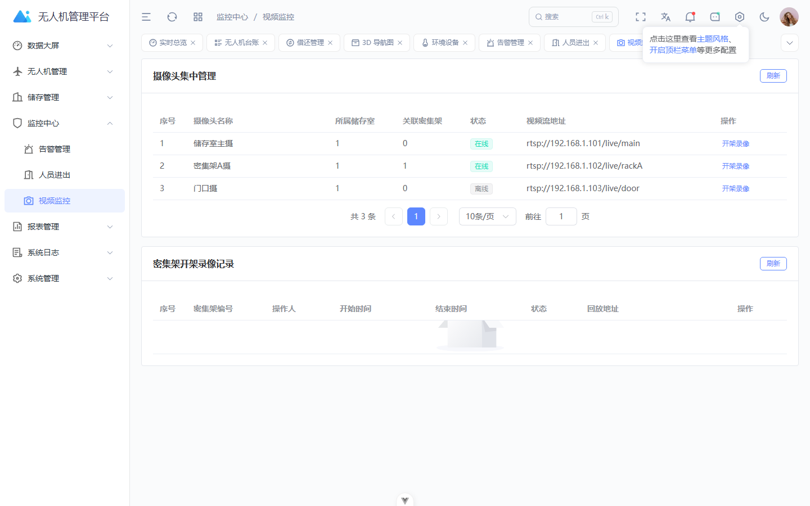

### 统计报表

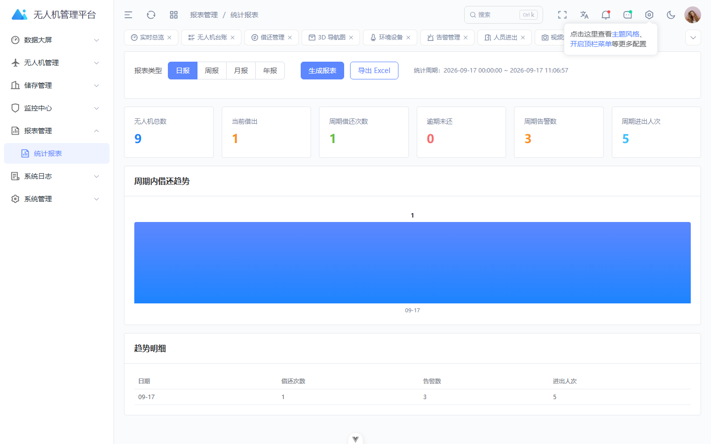

### 系统日志

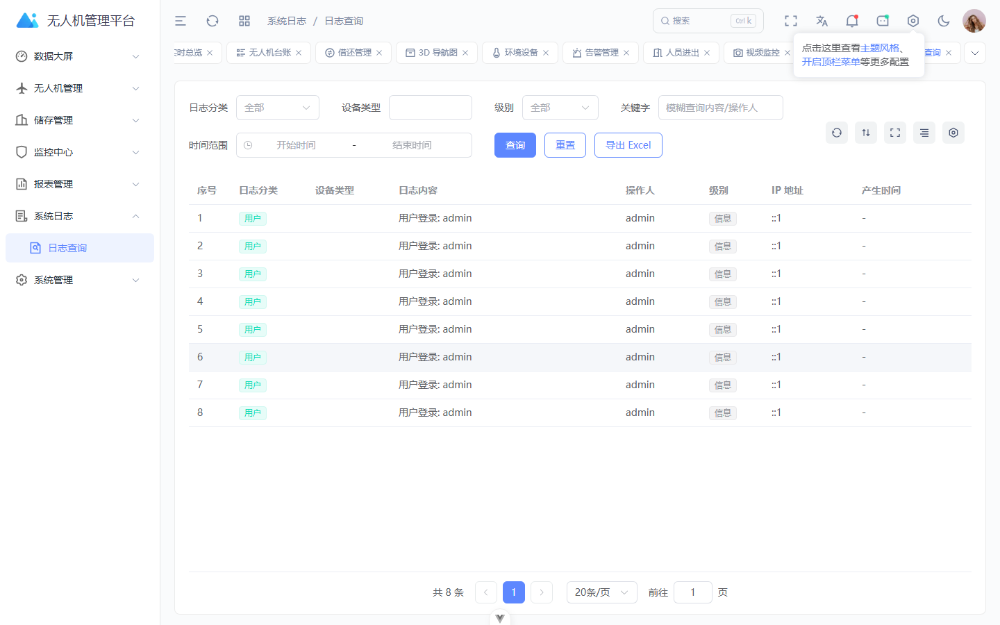

### 用户管理

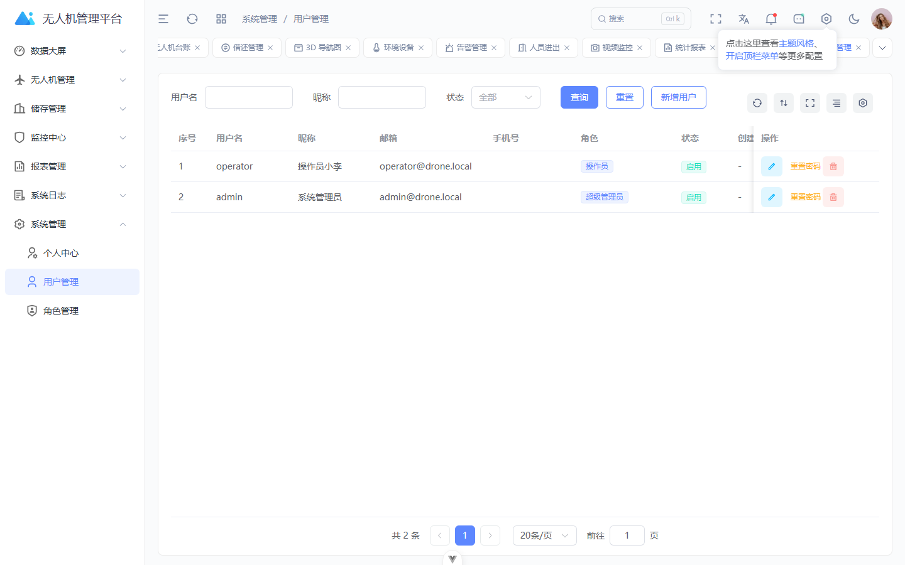

### 角色管理

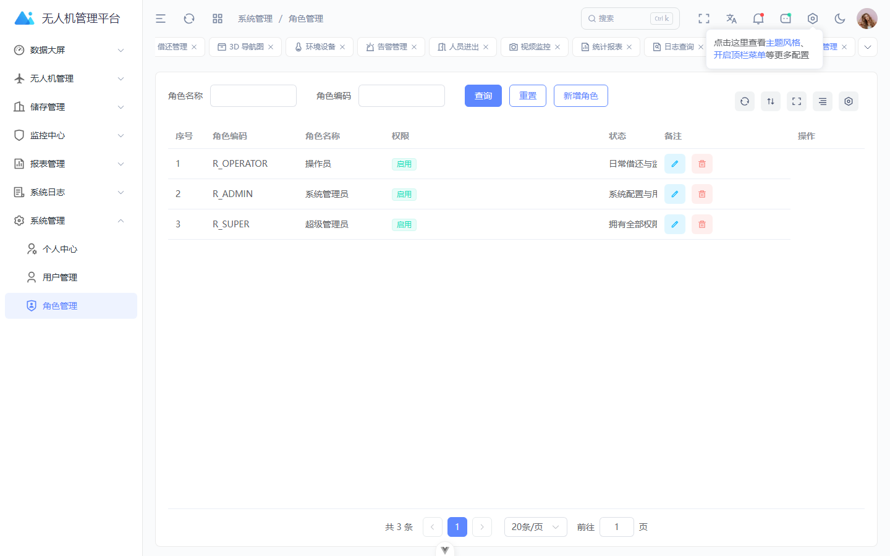

### 个人中心

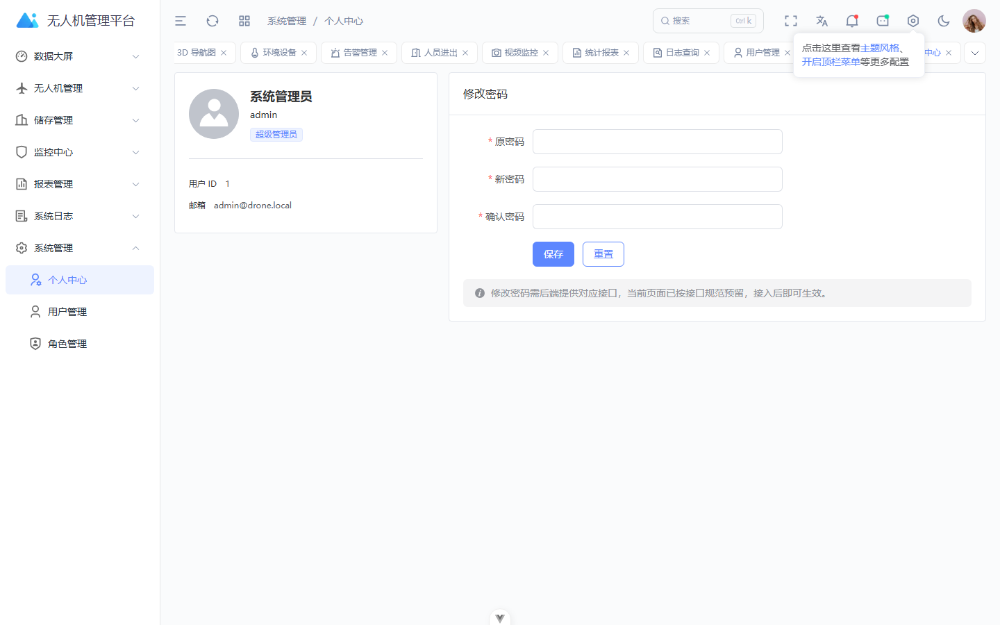

## 七、目录结构

```
DroneManagement/
├── server/                 # 后端（Go + Gin）
│   ├── config/             # 配置（config.yaml）
│   ├── internal/
│   │   ├── controller/     # 接口实现
│   │   ├── db/             # 数据库初始化与种子数据
│   │   ├── models/         # 数据模型
│   │   ├── middleware/     # JWT / CORS 中间件
│   │   └── router/         # 路由注册
│   └── API接口文档.md       # 接口技术文档
├── src/                    # 前端（Vue 3）
│   ├── api/                # 接口服务层
│   ├── views/drone/        # 业务页面（大屏/借还/储存/监控/报表/日志/系统）
│   ├── router/             # 前端路由与菜单
│   ├── config/             # 前端配置（系统名称等）
│   └── utils/drone/        # 业务字典等工具
└── ...
```

## 八、定制与商务联系

如需功能定制、私有化部署、源码授权或技术支持，欢迎通过以下方式联系：

- **QQ：467643531**
- 支持需求调研、界面换肤、国产数据库适配、第三方系统对接等定制化服务。

